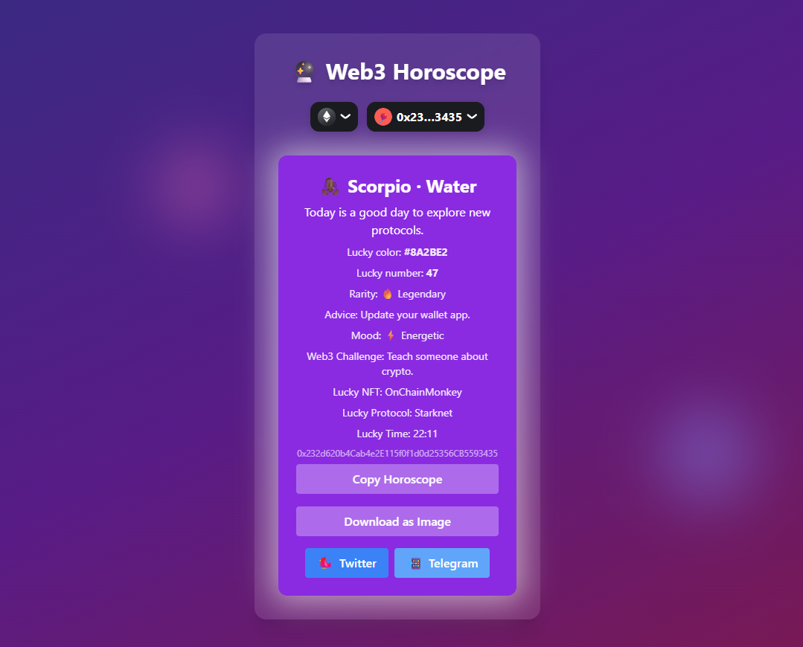

# 🔮 Web3 Horoscope

**Web3 Horoscope** is a fun, mystical, and fully on-chain-inspired dApp that generates a unique, personalized horoscope based on your Ethereum wallet address. Connect your wallet and instantly reveal your:

> Zodiac sign • Element • Lucky color • Lucky number • Rarity • Advice • Mood • Daily challenge • Lucky NFT • Protocol • Time • and more...



---

## ✨ Features

- 🔗 **Connect any Ethereum wallet** (MetaMask, WalletConnect, etc.) via RainbowKit + Wagmi
- 🧠 **Address-based identity**: all traits generated pseudo-randomly from your wallet address
- ♈ **Zodiac Sign** + 🌍 **Elemental alignment** (Fire, Earth, Air, Water)
- 🎨 **Lucky color** & 🔢 **Lucky number**
- 🧙‍♂️ **Web3 fortune**: a fresh prediction each day
- 🎯 **Rarity score**: how "rare" is your address?
- 💌 **Personalized advice** & 😎 **mood of the day**
- 🧪 **Web3 challenge**: educational or funny
- 🖼️ **Lucky NFT & Protocol** suggestions
- ⏰ **Lucky Time** for your Web3 actions
- 📋 **Copy to clipboard**, 🖼️ **Export as image**, 📤 **Share on Twitter & Telegram**
- ✨ **Responsive, animated UI** powered by Tailwind CSS (glow, fade-in, particles, etc.)

---

## 🚀 Live Demo

👉 [**Try the Horoscope dApp →**](https://web3-horoscope.vercel.app/)

---

## 🛠️ Tech Stack

- ⚛️ [React](https://react.dev/)
- 🧙 [Wagmi](https://wagmi.sh/)
- 🌈 [RainbowKit](https://rainbowkit.com/)
- 🎨 [Tailwind CSS](https://tailwindcss.com/)
- 📸 [html2canvas](https://www.npmjs.com/package/html2canvas) – image export
- 🔗 [Viem](https://viem.sh/) (via Wagmi)

---

## ⚙️ Getting Started

### 1. Clone the repo

```bash
git clone https://github.com/martinperezcss/web3-horoscope.git
cd web3-horoscope
```

### 2. Install dependencies

```bash
yarn install
```

### 3. Configure environment variables

Create a `.env` file at the root of the project and add your WalletConnect Cloud Project ID:

```env
REACT_APP_WALLETCONNECT_PROJECT_ID=your_project_id_here
```

> 🧩 You can get a free project ID by creating a project at [WalletConnect Cloud](https://cloud.walletconnect.com).

---

### 4. Start the development server

```bash
yarn start
```

Once the server is running, open your browser and go to:

```
http://localhost:3000
```

You should now see your mystical Web3 Horoscope live! 🔮✨

---

## 📦 Building for Production

To build the app for production:

```bash
yarn build
```

This will create an optimized build in the `build/` folder. You can then deploy it using services like:

- **Vercel**
- **Netlify**
- **Surge**
- **Fleek** – for decentralized hosting
- **IPFS / Filecoin** for on-chain vibes ✨

---

## 🧙 Customize Your Horoscope

Want to make it your own? Here are the main files to tinker with:

| File                      | Purpose                                      |
|---------------------------|----------------------------------------------|
| `src/utils/horoscope.js`  | Core logic: signs, colors, advice, lucky numbers |
| `src/components/`         | Modular UI components                        |
| `src/Home.js`             | Main layout logic                            |
| `src/index.css`           | Styles and animations via Tailwind           |
| `public/screenshot.png`   | Update with your own preview                 |

---

## 🤝 Contributing

Have an idea to make the stars align even better?

1. **Fork this repo**
2. **Create your branch:**  
    ```bash
    git checkout -b feature/amazing-idea
    ```
3. **Commit your changes:**  
    ```bash
    git commit -m '✨ Add awesome feature'
    ```
4. **Push and open a pull request**

Open issues first if your idea is big or breaking — let’s chat before you code! 🛠️

---

## 📄 License

MIT © 2024 Martin Perez

---

## 🌟 Connect With the Creator

💼 LinkedIn: [linkedin.com/in/martinpcs](https://linkedin.com/in/martinpcs)

---

⚠️ **Disclaimer:** This dApp is for entertainment purposes only. No astrological, financial, or spiritual advice is being given. It's all blockchain fun! 🪄